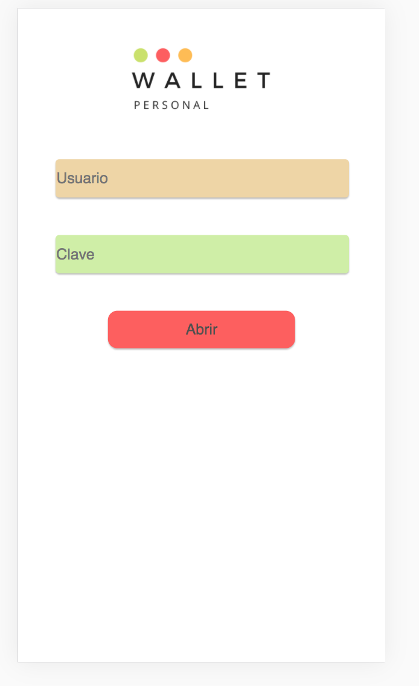
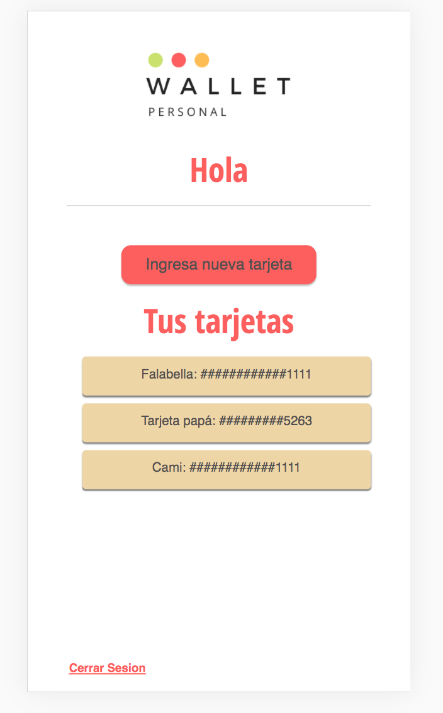
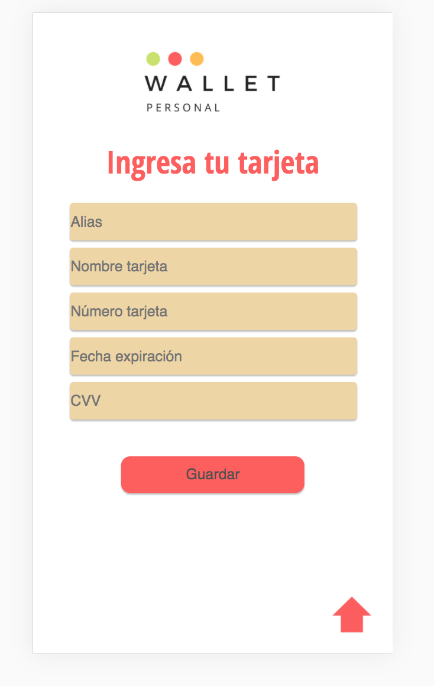
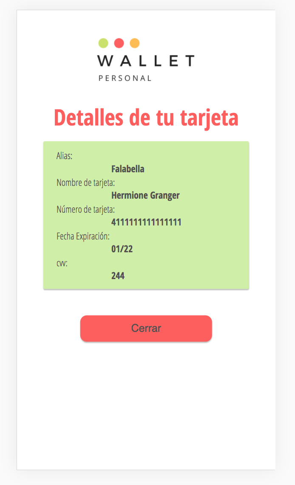
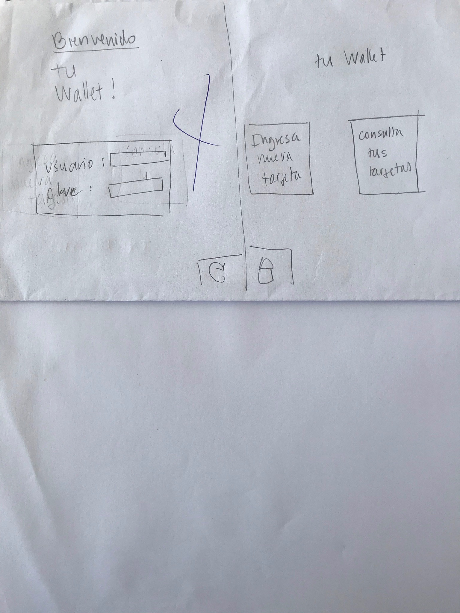
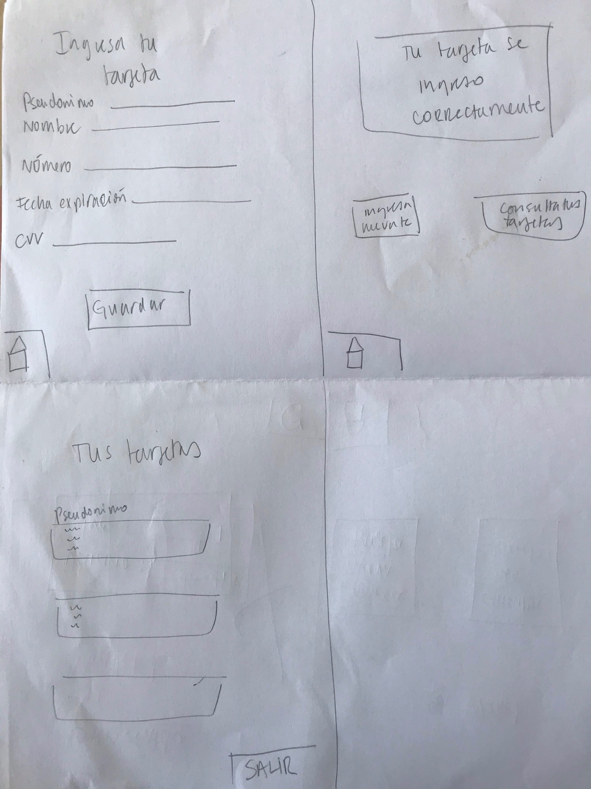
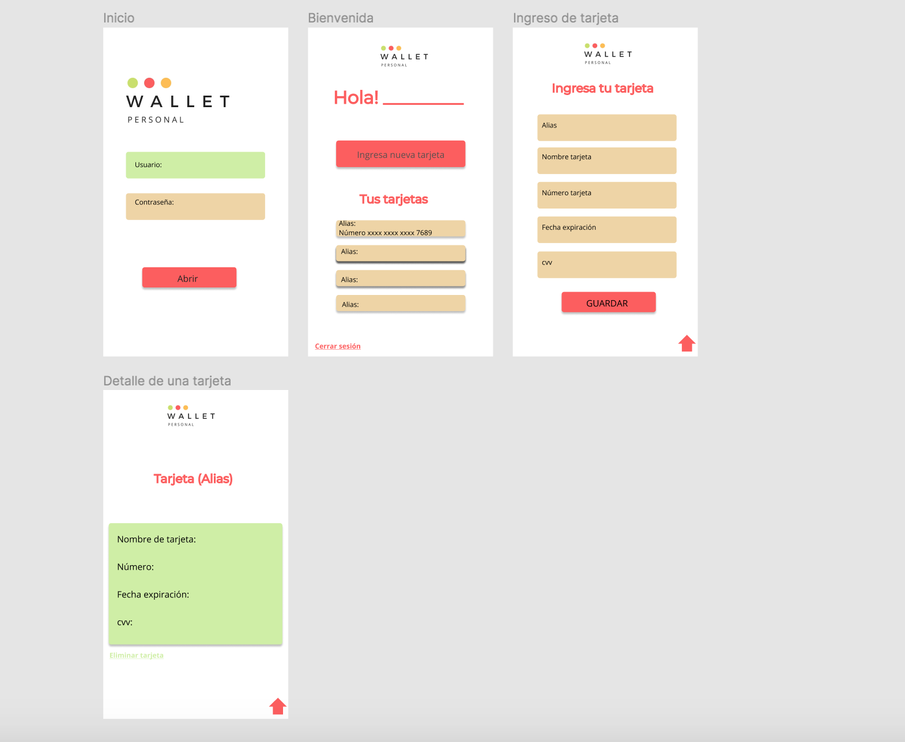

##### `README.md`

## Nombre del proyecto: 
 "Wallet Personal"
## Resumen del  proyecto:
El proyecto es una aplicación web para móviles para una billetera electrónica de tarjetas de crédito.
## Organización del proyecto:
Para comenzar el trabajo en primera instacia pensé en la cantidad de sprints que le daría, en este caso fueron 2, según eso fui planificando mis tareas. También leí los objetivos de aprendizaje que me daban una pista de las herramientas que debía utilizar.

Paso 1 : Hacer un trello con las listas de tareas que se me ocurrían en ese momento (Ej: prototipo en papel/testear prototipo figma/testear)

Paso 2: Para mi lo mas importante fue hacer un flujograma donde indicaba paso a paso lo que hacía mi producto y sus funcionalidades 

Paso 3: Hacer las funciones que resolvian el problema matemático de validación y maskify (Cómo debía trabajar con un número ingresado por un usuario empecé con un prompt que luego iba a reemplazar), al terminar las funciones hice los test

Paso 4: Ir paso a paso por mi flujograma y hacer de estos pasos mis objetivos

## La imagen final de tu proyecto:

## Investigación UX:

### Quiénes son los usuarios y los objetivos en relación con el producto:
* Los usuarios son todas las personas de entre 25-55 años, el objetivo es tener acceso de forma rápida a las tarjetas de crédito que el usuario guarde para los fines que estime conveniente .

### Cómo el producto soluciona los problemas/necesidades de dichos usuarios:
* La idea de esta aplicación nace de la problemática de que hoy en día nos enfrentamos a varias situaciones donde los pagos son online y con tarjetas de crédito, a veces no se tiene la billetera a nuestro alcance por lo que tenerlas guardadas en una app soluciona el hecho de no poder concretar un pago por no tener la tc
### Foto de tu primer prototipo en papel:

### Resumen del feedback recibido indicando las mejoras a realizar.
* Feedback  prototipo en papel:

> Buena idea pero debería ser muy seguro (Como la página del banco o mas)

> Muy enredado para poder volver al home y consultar las tc, muchas páginas.

> El boton salir del resumen de "Tus tarjetas" es confuso
* Feedback prototipo en figma:

> El color del boton "ingresar tarjeta" deberia ser mas llamativo 

> Falta un boton en la página "Login" que indique "Iniciar sesión" o "abrir"

> Los colores estan sobrios y adecuados

### Imagen del prototipo final:

  
